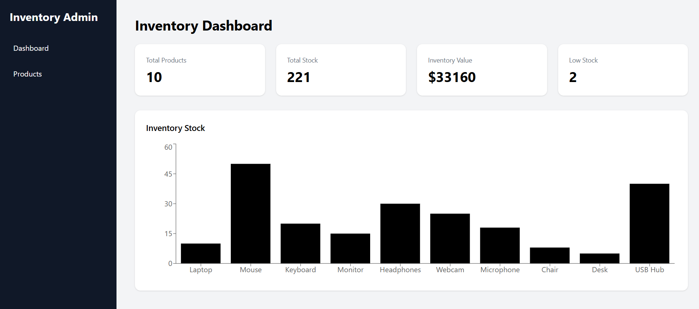
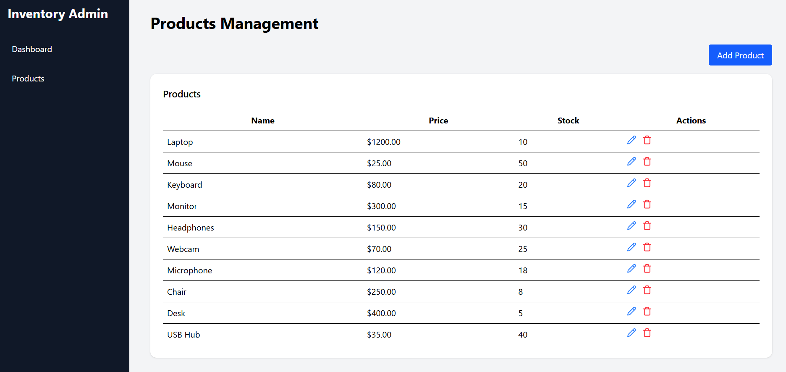
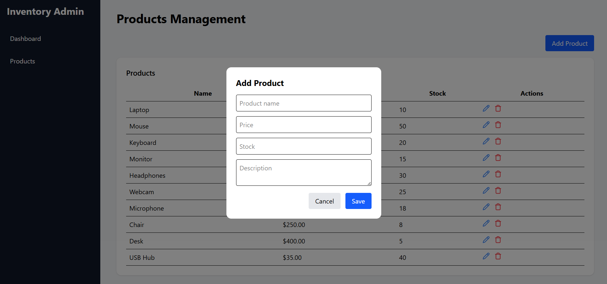

# Inventory Admin Dashboard

Fullstack inventory management system built with Laravel and React.

## Backend

cd backend

composer install

cp .env.example .env

php artisan key:generate

php artisan migrate

php artisan serve

## Frontend

cd frontend

npm install

npm run dev

## Seed Sample Data

The project includes a script to populate the database with sample products.

This is useful for testing the dashboard with preloaded data.

### Run the seed script

Make sure the backend server is running:

cd backend

php artisan serve

Then run the seed script from the project root:

node seedProducts.js

This will insert 10 sample products into the database, allowing the dashboard to display inventory statistics and product management features immediately.

## Screenshots

### Dashboard

### Products

### Create Product

